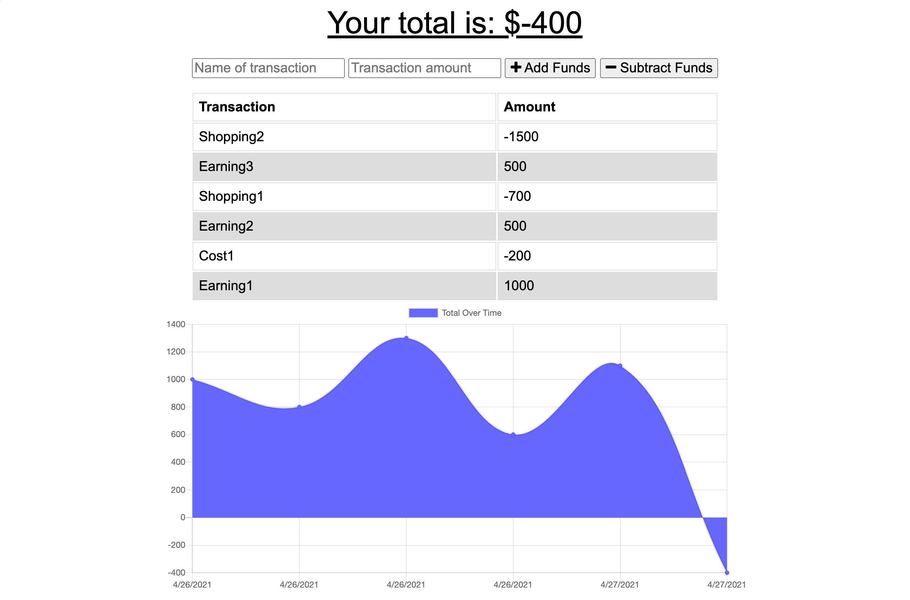

<h1 align="center">Budget tracker</h1>

 

## Description 
Using Progressive Web Application (PWA) this application enables the user to add expenses and deposits to their budget with or without an online connection. When entering transactions offline, data should populate the total when connected back online.

 

## Screenshot

  

## Table of Contents

- [Description](#description)
- [Installation](#installation)
- [Usage](#usage)
- [License](#license)
- [Contribution](#contributing)
- [Tests](#tests)
- [Questions](#questions)

## Installation
Users can view the deployed project [here](https://protected-tundra-99262.herokuapp.com/). If you intend to iterate on the project, besides downlodaing the repo to your machine, be sure to run `npm install` in the root diractory and to also have MongoDB installed and ready.

## Usage
AS AN avid traveller I WANT to be able to track my withdrawals and deposits with or without a data/internet connection SO THAT my account balance is accurate when I am traveling

 

Giving users a fast and easy way to track their money is important, but allowing them to access that information anytime is even more important. Having offline functionality is paramount to our applications success.

## License
 
This application is covered by the MIT license.

## Contributing
[Gary Chen](https://github.com/GaryChen513)

## Tests
no

## Questions
Contact me with any question: [Github](https://github.com/GaryChen513), 
[Email](mailto:garychen19970513@gmail.com)
